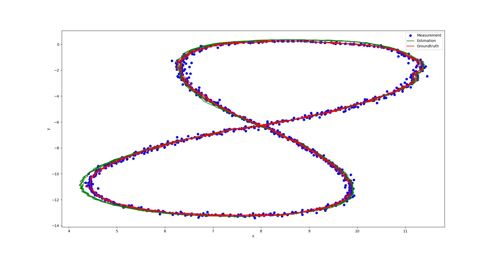
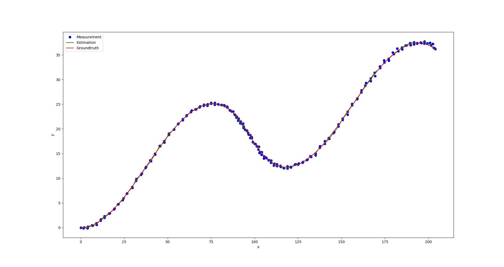

# Lidar & Radar Fusion with EKF and UKF

-----

[TOC]

## Introduction

This is an **Kalman Filter** (EKF & UKF) implementation in C++ for **fusing lidar and radar sensor measurements**.

In this case, we have two 'noisy' sensors:

- A **lidar** sensor that measures our position in cartesian-coordinates `(x, y)`
- A **radar** sensor that measures our position and relative velocity (the velocity within line of sight) in polar coordinates `(rho, phi, drho)`

### EKF

We want to predict our position, and how fast we are going in what direction at any point in time:

- the position and velocity of the system in cartesian coordinates: `(x, y, vx, vy)`

- We are assuming a **constant velocity model (CV)** for this particular system

Note:
- The **measurement covariance matrices** `lidar_R` and `radar_R` are hard-coded in `src/fusionekf.cpp`.
- The **initial state covariance matrix** `P` is hard-coded in `src/fusionekf.cpp`.
- The **process 2d noise** `ax` and `ay` used to **update the process covariance matrix** `Q` is hard-coded in `include/fusionekf.h`.

### UKF

- In essence we want to get: the position of the system in cartesian coordinates, the velocity magnitude, the yaw angle in radians, and yaw rate  in radians per second `(x, y, vx, vy, yaw, yawrate)`

- We are assuming a **constant turn/yaw rate and velocity magnitude model** (CRTV) for this particular system

- **Compared with an EKF with a constant velocity model, RMSE should be lower for the UKF especially for velocity. The CTRV model is more precise than a constant velocity model. And UKF is also known for handling non-linear equations better than EKF.**


## Build

```sh
make build & cd build
cmake .. & make -j3
```

## Run

### EKF

* run with datafile (data-1, data-2)

  ```sh
  ./extended_kf ../data/data-1.txt output.txt
  ```

* Please use the following format for your input file

  ```
  L(for lidar) m_x m_y t r_x r_y r_vx r_vy
  R(for radar) m_rho m_phi m_drho t r_px r_py r_vx r_vy

  Where:
  (m_x, m_y) - measurements by the lidar
  (m_rho, m_phi, m_drho) - measurements by the radar in polar coordinates
  (t) - timestamp in unix/epoch time the measurements were taken
  (r_x, r_y, r_vx, r_vy) - the real ground truth state of the system

  Example:
  R 8.60363 0.0290616 -2.99903  1477010443399637  8.6 0.25  -3.00029  0
  L 8.45  0.25  1477010443349642  8.45  0.25  -3.00027  0
  ```

* The program outputs the predictions in the following format on the output file path you specified

  ```
  p_x p_y p_vx p_vy m_x m_y r_px r_py r_vx r_vy

  Where:
  (p_x, p_y, p_vx, p_vy) - the predicted state of the system by FusionEKF
  (m_x, m_y) - the position value as measured by the sensor converted to cartesian coordinates
  (r_x, r_y, r_vx, r_vy) - the real ground truth state of the system

  Example:
  4.53271 0.279 -0.842172 53.1339 4.29136 0.215312  2.28434 0.226323
  43.2222 2.65959 0.931181  23.2469 4.29136 0.215312  2.28434 0.226323
  ```

* draw the position data from `output.txt`
  
  - input `data-1.txt`

    <p align="center">
      
    </p>

  - input `data-2.txt`

    <p align="center">
      
    </p>  

### UKF

* run with datafile (data-3)

  ```sh
  ./unscented_kf ../data/data-3.txt out-3.txt
  ```

* Please use the following format for your input file

  ```
  L(for lidar) m_x m_y t r_x r_y r_vx r_vy, r_yaw, r_yawrate
  R(for radar) m_rho m_phi m_drho t r_px r_py r_vx r_vy, r_yaw, r_yawrate

  Where:
  (m_x, m_y) - measurements by the lidar
  (m_rho, m_phi, m_drho) - measurements by the radar in polar coordinates
  (t) - timestamp in unix/epoch time the measurements were taken
  (r_x, r_y, r_vx, r_vy, r_yaw, r_yawrate) - the real ground truth state of the system

  Example:
  L 3.122427e-01  5.803398e-01  1477010443000000  6.000000e-01  6.000000e-01  5.199937e+00  0 0 6.911322e-03
  R 1.014892e+00  5.543292e-01  4.892807e+00  1477010443050000  8.599968e-01  6.000449e-01  5.199747e+00  1.796856e-03  3.455661e-04  1.382155e-02
  ```

* The program outputs the predictions in the following format on the output file path you specified

  ```
  time_stamp  px_state  py_state  v_state yaw_angle_state yaw_rate_state  sensor_type NIS px_measured py_measured px_ground_truth py_ground_truth vx_ground_truth vy_ground_truth
  1477010443000000  0.312243  0.58034 0 0 0 lidar 2.32384e-319  0.312243  0.58034 0.6 0.6 0 0
  1477010443050000  0.735335  0.629467  7.20389 9.78669e-18 5.42626e-17 radar 74.6701 0.862916  0.534212  0.859997  0.600045  0.000345533 4.77611e-06
  ...
  ```


## Ref

### EKF

* based on [mithi/fusion-ekf](https://github.com/mithi/fusion-ekf), and its related python code is [mithi/fusion-ekf-python](https://github.com/mithi/fusion-ekf-python)

  - [Sensor Fusion and Object Tracking using an Extended Kalman Filter Algorithm — Part 1](https://medium.com/@mithi/object-tracking-and-fusing-sensor-measurements-using-the-extended-kalman-filter-algorithm-part-1-f2158ef1e4f0)

  - [Sensor Fusion and Object Tracking using an Extended Kalman Filter Algorithm — Part 2
  ](https://medium.com/@mithi/sensor-fusion-and-object-tracking-using-an-extended-kalman-filter-algorithm-part-2-cd20801fbeff)

* [udacity/CarND-Extended-Kalman-Filter-Project](https://github.com/udacity/CarND-Extended-Kalman-Filter-Project): Self-Driving Car Nanodegree Program Starter Code for the Extended Kalman Filter Project

* [Sensor Fusion (towardsautonomy)](http://www.towardsautonomy.com/sensor_fusion)

### UKF

* [mithi/fusion-ukf](https://github.com/mithi/fusion-ukf)
* [udacity/CarND-Unscented-Kalman-Filter-Project](https://github.com/udacity/CarND-Unscented-Kalman-Filter-Project): Unscented Kalman Filter Project Starter Code
* [udacity/CarND-Catch-Run-Away-Car-UKF](https://github.com/udacity/CarND-Catch-Run-Away-Car-UKF) (Deprecated): Run Away Robot with Unscented Kalman Filter Bonus Challenge Starter Code
